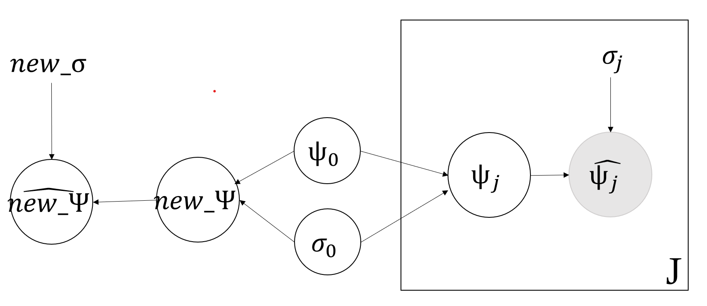

## Solution for Problem 1
### (a)
- (i)
```{r}
set.seed(816)
alpha_pri_1 = rexp(1000, rate = 0.001)
beta_pri_1 = rexp(1000, rate = 0.001)
plot(log(alpha_pri_1), log(beta_pri_1), pch=".", cex=2)
```

- (ii)
```{r}
theta_post_1 = rbeta(1000, alpha_pri_1, beta_pri_1)
hist(theta_post_1, freq=FALSE)
```

### (b)
(i)
```{r}
phi_1 = runif(1000, 0, 1)
phi_2 = runif(1000, 0, 1000)
alpha_pri_2 = phi_1 / (phi_2 ^ 2)
beta_pri_2 = (1 - phi_1) / (phi_2 ^ 2)
plot(log(alpha_pri_2), log(beta_pri_2),pch=".", cex=2)
```

(ii)
```{r}
theta_post_2 = rbeta(1000, alpha_pri_2, beta_pri_2)
hist(theta_post_2, freq=FALSE, xlim=c(0,1))
```

## Solution for Problem 2
### (a)
The improper prior densities of hyperpriors are:
$$p(\psi_0) \propto 1 \text{ }for\text{ } \psi_0 \in (-\infty, \infty)$$
$$p(\sigma_0) \propto 1 \text{ }for\text{ }\sigma_0\text{ } \in (0, \infty)$$

### (b)

```{r echo=FALSE, out.width = "300px"}
knitr::include_graphics("./dag.png")
```

### (c)
JAGS Model Definition:
```{r eval=FALSE, echo=TRUE}
model {
  for (j in 1:length(psihat)) {
    psihat[j] ~ dnorm(psi[j], 1 / (sigma[j] ^ 2))
    psi[j] ~ dnorm(psi0, 1 / (sigma0 ^ 2))
  }

  psi0 ~ dnorm(0, 1 / (1000 ^ 2))
  sigma0 ~ dunif(0, 1000)

  sigmasq0 <- sigma0 ^ 2
}
```

```{r message=FALSE, warning=FALSE}
library(rjags)

df = read.table("data.txt", header=TRUE)[, 2:3]

model_1 = jags.model("asgn2template.bug", df)
```

### (d)
```{r}
update(model_1, 10000)
x_1 = coda.samples(model_1, c("psi0","sigmasq0"), n.iter=10000)
```
(1) Numerical summary of posterior densities for $\psi_0$,
```{r}
psi0 = as.matrix(x_1)[,"psi0"]
summary(psi0)
```

and $\sigma^2_0$,

```{r}
sigmasq0 = as.matrix(x_1)[,"sigmasq0"]
summary(sigmasq0)
```

(2) Graphical estimates of posterior densities for $\psi_0$ and $\sigma^2_0$,

```{r message=FALSE}
require(lattice)

densityplot(x_1[,c("psi0","sigmasq0")])
```

(5) 
```{r}
psi0_mean = mean(psi0)
psi0_sd = sd(psi0)
psi0_95 = quantile(psi0, c(0.025, 0.975))

sigmasq0_mean = mean(sigmasq0)
sigmasq0_sd = sd(sigmasq0)
sigmasq0_95 = quantile(sigmasq0, c(0.025, 0.975))
```

- Posterior expected values for $\psi_0$: `r psi0_mean`
- Posterior standard deviations for $\psi_0$: `r psi0_sd`
- 95% central posterior intervals for $\psi_0$: (`r psi0_95[[1]]`, `r psi0_95[[2]]`)
- Posterior expected values for $\sigma^2_0$: `r sigmasq0_mean`
- Posterior standard deviations for $\sigma^2_0$: `r sigmasq0_sd`
- 95% central posterior intervals for $\sigma^2_0$: (`r sigmasq0_95[[1]]`, `r sigmasq0_95[[2]]`)

### (e)
(i)
```{r echo=FALSE, out.width = "300px"}

```

(ii)
JAGS Model Definition:
```{r eval=FALSE, echo=TRUE}
model {
  for (j in 1:length(psihat)) {
    psihat[j] ~ dnorm(psi[j], 1 / (sigma[j] ^ 2))
    psi[j] ~ dnorm(psi0, 1 / (sigma0 ^ 2))
  }

  psi0 ~ dnorm(0, 1 / (1000 ^ 2))
  sigma0 ~ dunif(0, 1000)

  psihat_new ~ dnorm(psi_new, 1 / (sigma_new^2))
  psi_new ~ dnorm(psi0, 1 / (sigma0 ^ 2))
  psihat_new_ind <- psihat_new >= 2 * psi_new
}
```

```{r}
model_new = jags.model("asgn2template_new.bug", c(as.list(df), sigma_new = 0.25))
update(model_new, 10000)
x_new = coda.samples(model_new, c("psihat_new","psihat_new_ind"), n.iter=10000)
```


(iii)
```{r}
psihat_new = as.matrix(x_new)[, "psihat_new"]
psihat_new_ind = as.matrix(x_new)[, "psihat_new_ind"]

psihat_new_mean = mean(psihat_new)
psihat_new_sd = sd(psihat_new)
psihat_new_95 = quantile(psihat_new, c(0.025, 0.975))

psihat_new_ind_mean = mean(psihat_new_ind)
```

- Posterior mean forthe estimated log-odds ratio: `r psihat_new_mean`
- Posterior standard deviations for the estimated log-odds ratio: `r psihat_new_sd`
- 95% central posterior intervals for the estimated log-odds ratio: (`r psihat_new_95[[1]]`, `r psihat_new_95[[2]]`)

(iv)

Posterior predictive probability that the new estimated
log-odds ratio will be at least twice its standard error: `r psihat_new_ind_mean`
