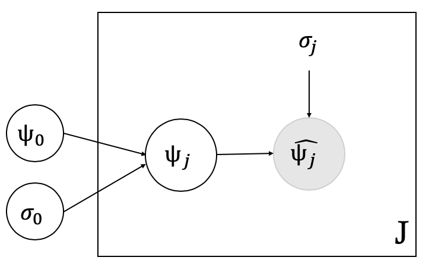

## Solution for Problem 1
### (a)
- (i)
```{r}
set.seed(816)
alpha_pri_1 = rexp(1000, rate = 0.001)
beta_pri_1 = rexp(1000, rate = 0.001)
plot(log(alpha_pri_1), log(beta_pri_1), pch=".", cex=2)
```

- (ii)
```{r}
theta_post_1 = rbeta(1000, alpha_pri_1, beta_pri_1)
hist(theta_post_1, freq=FALSE)
```

### (b)
(i)
```{r}
phi_1 = runif(1000, 0, 1)
phi_2 = runif(1000, 0, 1000)
alpha_pri_2 = phi_1 / (phi_2 ^ 2)
beta_pri_2 = (1 - phi_1) / (phi_2 ^ 2)
plot(log(alpha_pri_2), log(beta_pri_2),pch=".", cex=2)
```

(ii)
```{r}
theta_post_2 = rbeta(1000, alpha_pri_2, beta_pri_2)
hist(theta_post_2, freq=FALSE, xlim=c(0,1))
```

## Solution for Problem 2
### (a)
The improper prior densities of hyperpriors are:
$$p(\psi_0) \propto  1 , -\infty < \psi_0 < \infty$$
$$p(\sigma_0) \propto  1 , \sigma_0 > 0$$

### (b)
See Figure.1 



### (c)

