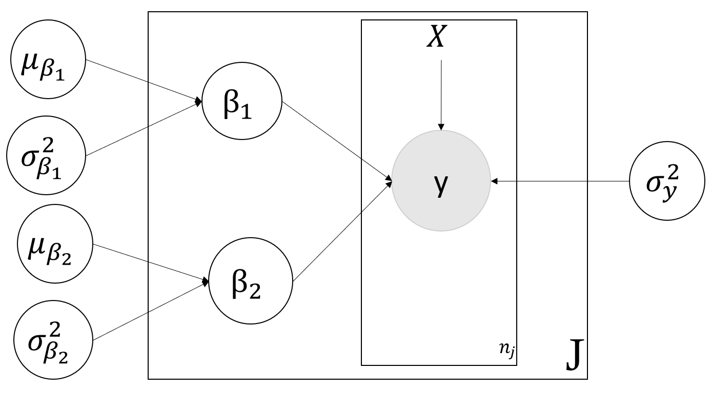
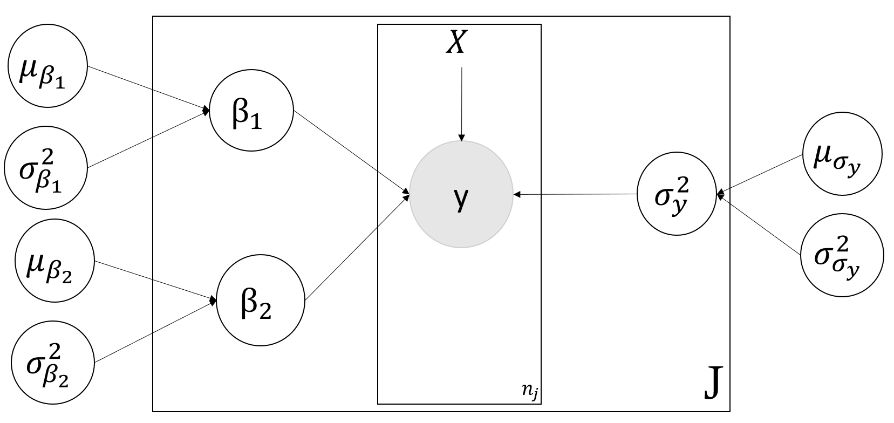

## Solution for Problem (a)
```{r}
AQI = log(as.matrix(read.csv("ozoneAQIaug.txt", sep="", header=TRUE)))

city_count = dim(AQI)[1]
day_count = dim(AQI)[2]
beta_j_hat = array(0, c(city_count,2))
day_cent = (1:day_count) - mean(1:day_count)
X = as.matrix(data.frame(x1=1, x2=day_cent))

X_hat = solve(t(X) %*% X) %*% t(X)

for (j in 1:city_count) {
  beta_j_hat[j,] = X_hat %*% AQI[j,]
}
```
### (i)
```{r}
plot(beta_j_hat, xlab="Beta1_hat_j", ylab="Beta2_hat_j", col="red", pch="x")
for (i in 1:dim(beta_j_hat)[1]){
  text(beta_j_hat[i,1], beta_j_hat[i,2], rownames(AQI)[i], cex = .8)
}

```

### (ii)
```{r}
apply(beta_j_hat,2,mean)
```

### (iii)
```{r}
apply(beta_j_hat,2,var)
```
### (iv)
```{r}
cor(beta_j_hat[,1],beta_j_hat[,2])
```


## Solution for Problem (b)
### (i)
```{r eval=FALSE, include=TRUE}
data {
    dim_y <- dim(AQI)
    day_cent <- day - mean(day)
}
model {
    for (j in 1:dim_y[1]) {
        for (i in 1:dim_y[2]) {
            AQI[j,i] ~ dnorm(beta[1,j] + beta[2,j] * day_cent[i], sigma_sq_y_inv)
        }
        beta[1:2,j] ~ dmnorm(mu_beta, sigma_beta_inv)
    }
    mu_beta ~ dmnorm(mu_beta_0, sigma_mu_beta_inv)
    sigma_beta_inv ~ dwish(2 * sigma_0, 2)
    sigma_sq_y_inv ~ dgamma(0.0001, 0.0001)
    sigma_beta <- inverse(sigma_beta_inv)
    rho <- sigma_beta[1,2] / sqrt(sigma_beta[1,1] * sigma_beta[2,2])
    sigma_sq_y <- 1 / sigma_sq_y_inv
}
```

```{r  message=FALSE, results='hide'}
library(rjags)

df_jags_1 <- list(AQI = AQI,
                day = 1:31,
                mu_beta_0 = c(0, 0),
                sigma_mu_beta_inv = rbind(c(1/(1000^2), 0),
                                       c(0, 1/(1000^2))),
                sigma_0 = rbind(c(0.1, 0),
                               c(0, 0.001)))

initial_vals_1 <- list(list(sigma_sq_y_inv = 1000, mu_beta = c(1000, 10),
                          sigma_beta_inv = rbind(c(100, 0),
                                               c(0, 100))),
                     list(sigma_sq_y_inv = 0.001, mu_beta = c(-1000, 10),
                          sigma_beta_inv = rbind(c(100, 0),
                                               c(0, 100))),
                     list(sigma_sq_y_inv = 1000, mu_beta = c(1000, -10),
                          sigma_beta_inv = rbind(c(0.001, 0),
                                               c(0, 0.001))),
                     list(sigma_sq_y_inv = 0.001, mu_beta = c(-1000, -10),
                          sigma_beta_inv = rbind(c(0.001, 0),
                                               c(0, 0.001))))
model_1 <- jags.model("aqi_1.bug", df_jags_1, initial_vals_1, n.chains = 4, 
                      n.adapt = 1000)
update(model_1, 10000)
coef_sample_1 <- coda.samples(model_1, c("mu_beta","sigma_beta","sigma_sq_y","rho"), 
                              n.iter = 2000)
```

```{r}
gelman.diag(coef_sample_1, autoburnin=FALSE, multivariate=FALSE)
```
### (ii)
```{r}
summary(coef_sample_1)
```

### (iii)
```{r}
rho_sample = as.matrix(coef_sample_1)[,"rho"]
quantile(rho_sample, c(0.025, 0.975)) 
```
```{r}
densplot(coef_sample_1[, c("rho")], main = "Density of Rho")
```

### (iv)
Approximate the posterior probability that $\rho$ > 0.

```{r}
mean(rho_sample > 0)
```

Bayes factor favoring $\rho$ > 0 versus $\rho$ < 0.
```{r}
mean(rho_sample > 0) / mean(rho_sample < 0)
```

From the 15 fitted (ordinary least squares) models in (a) and draw the fitted line as below. We can inspect some lines (for example:7) that start with lower intercepts also change more slowly than others (for example: 13), this means the correlation between intercept and slope would be positively related. Thus we can see this as evidence from data that $\rho$>0.

```{r}
plot(1:31, AQI[2,], ylim=c(3,5),type="n", xlab = "Day", ylab = "AQI_Log")
for (i in 1:dim(beta_j_hat)[1]){
  abline(beta_j_hat[i,], col="blue")
  text(i, beta_j_hat[i,1] + beta_j_hat[i,2] * i, i, cex = 0.8, col = "red")
}
```


### (v)
```{r}
mu_beta_2 = as.matrix(coef_sample_1)[,"mu_beta[2]"]
quantile(exp(30 * mu_beta_2), c(0.025, 0.975)) 
```


### (vi)
```{r}
dic.samples(model_1, 100000)
```
Actual number of parameters is: 30 ($\beta^{(j)}s$) + 1 ($\sigma^2_y$) + 2 ($\mu_{\beta}$) + 3 ($\sum_{\beta}$) = 36.

## Solution for Problem (c)
### (i)
```{r echo=FALSE, out.width = "300px"}

```

### (ii)
```{r eval=FALSE, include=TRUE}
data {
    dim_y <- dim(AQI)
    day_cent <- day - mean(day)
}
model {
    for (j in 1:dim_y[1]) {
        for (i in 1:dim_y[2]) {
            AQI[j,i] ~ dnorm(beta[1,j] + beta[2,j] * day_cent[i], sigma_sq_y_inv)
        }
        beta[1,j] ~ dnorm(mu_beta[1], 1 / sigma_sq_beta[1])
        beta[2,j] ~ dnorm(mu_beta[2], 1 / sigma_sq_beta[2])
    }
    mu_beta[1] ~ dnorm(0, 1 / (1000 ^2))
    mu_beta[2] ~ dnorm(0, 1 / (1000 ^2))
    sigma_beta[1] ~ dunif(0, 1000) 
    sigma_beta[2] ~ dunif(0, 1000)
    sigma_sq_beta[1] <- sigma_beta[1] ^ 2
    sigma_sq_beta[2] <- sigma_beta[2] ^ 2
    sigma_sq_y_inv ~ dgamma(0.0001, 0.0001)
    sigma_sq_y <- 1 / sigma_sq_y_inv
}
```


```{r  message=FALSE, results='hide'}
df_jags_2 <- list(AQI = AQI,
                day = 1:31)

initial_vals_2 <- list(list(sigma_sq_y_inv = 1000, mu_beta = c(1000, 10),
                            sigma_beta = c(0.01, 0.01)),
                     list(sigma_sq_y_inv = 0.001, mu_beta = c(-1000, 10),
                          sigma_beta = c(0.01, 0.01)),
                     list(sigma_sq_y_inv = 1000, mu_beta = c(1000, -10),
                          sigma_beta = c(1000, 1000)),
                     list(sigma_sq_y_inv = 0.001, mu_beta = c(-1000, -10),
                          sigma_beta = c(1000, 1000)))
model_2 <- jags.model("aqi_2.bug", df_jags_2, initial_vals_2, n.chains = 4, 
                      n.adapt = 1000)
update(model_2, 10000)
coef_sample_2 <- coda.samples(model_2, c("mu_beta","sigma_sq_beta","sigma_sq_y"), 
                              n.iter = 2000)
```
```{r}
gelman.diag(coef_sample_2, autoburnin=FALSE, multivariate=FALSE)
```

### (iii)
```{r}
summary(coef_sample_2)
```

### (iv)
```{r}
mu_beta_2 = as.matrix(coef_sample_2)[,"mu_beta[2]"]
quantile(exp(30 * mu_beta_2), c(0.025, 0.975)) 
```
Compared with previous results, this interval range is *smaller*.

### (v)
```{r}
dic.samples(model_2, 100000)
```
### (vi)
This model gives us smaller DIC (Penalized deviance), thus we prefer this model.

## Solution for Problem (d)
### (i)

Yes. AQI is impacted by lot of factors (for example: industry type, population etc) that depend on city, it is very likely that the variability in log-value depends on the city. To better model this case, we could make $\sigma^{(j)}_y$ for each city and give it a normal distribution (as illustrated in the following DAG). This will add 16 parameters including 2 hyperparameters.

```{r echo=FALSE, out.width = "300px"}

```

### (ii)

Yes. It is possible that there are time-series correlations in the successive log-values of
each city that are not captured by the simple linear regression model. Naturally, AQI of 2 consecutive day could be very close. This violate the assumption that responses from observations within a group should be exchangeable (i involved).

### (iii)

Yes, It is possible that there are spatial correlations among the log-values on a given
day that are not captured by the simple linear regression model. This violate the assumption that the response should be independent between groups (j involved).
